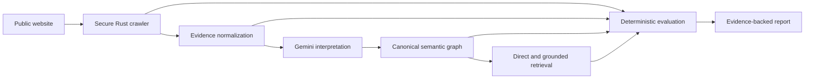

# SPECTRA

> See your website through the eyes of AI.

SPECTRA is an adaptive AI-search perception and machine-understanding platform. It answers a narrower and more useful question than a conventional SEO audit: **what does an AI system actually understand about this website, what evidence supports that understanding, and where does important information disappear?**

## Why it exists

Search visibility is an information pipeline, not a single page score. A fact can be present in source HTML yet vanish during crawling, extraction, semantic representation, model interpretation, or retrieval. Existing SEO tools mainly inspect technical health and rankings. Generic GEO checkers often produce opaque model-authored scores. SPECTRA instead keeps evidence through each stage and calculates deterministic, explainable measurements.



## Core thesis

- Classification comes first. SPECTRA determines the primary entity, archetype, purpose, and expected information classes before choosing checks.
- LLMs create typed observations, never final scores.
- A controlled evaluation-dimension registry determines what can affect a score. Irrelevant checks are N/A.
- Every entity, relationship, claim, issue, and metric can reference source evidence.
- Direct site understanding and Google-oriented search retrieval are separate evaluations.
- Partial results remain useful: model or grounding failures do not erase crawl evidence.

## Repository

```text
apps/web                 React/Vite report experience
apps/api                 Bun-compatible Hono orchestration API
services/crawler         Rust crawl and extraction engine
packages/schemas         Runtime-validated shared domain contracts
packages/model-gateway   Provider boundary and Gemini implementation
packages/evaluation      Normalization, contracts, issues, pipeline
packages/scoring         Versioned deterministic scoring engine
fixtures/sites           Known website fixtures and expectations
docs                     Architecture and scoring detail
```

The API creates immutable audit snapshots and exposes them at `/api/audits/:id`, and immutable journey trails at `/api/journeys/:id`. The default local store is filesystem-backed for zero-setup development; the relational production model is documented in [docs/architecture.md](docs/architecture.md) and maps directly to PostgreSQL.

## End-to-end flow

1. Validate and normalize a public HTTP(S) target.
2. Resolve DNS and reject loopback, private, link-local, unspecified, and metadata addresses.
3. Inspect robots.txt and sitemap hints; crawl within page, depth, concurrency, redirect, timeout, and body-size limits.
4. Extract metadata, headings, semantic text, links, canonical URLs, JSON-LD, fingerprints, and crawl edges as structured JSON.
5. Normalize repeated/noisy content while retaining evidence references.
6. Ask the configured model provider for schema-constrained classification and semantic observations.
7. Select supported evaluation dimensions for the site archetype.
8. Generate retrieval questions from evidence-backed claims; run direct evaluation and optional Google Search grounding.
9. Calculate `spectra-v0.1` metrics from registered checks and visible denominators.
10. Diagnose positioning bugs and produce evidence-linked repairs.

## Journey: watching an agent use the site

An audit answers "does an AI system know you exist". A journey answers the next
question: **can an agent that arrives with a job actually finish it here?**

One agent, one job, one site, recorded move by move. SPECTRA arrives as a real
answer-engine user-agent (`ChatGPT-User`, `PerplexityBot`, `ClaudeBot`,
`OAI-SearchBot` or `GPTBot`), reads `robots.txt` for that agent's own token and
honours it, then walks the site: at most eight page fetches, at most two web
searches, always on the domain it was pointed at. Gemini chooses each move from
nothing but the raw text of the page it is standing on, the links that were in
that HTML, and the trail behind it. It cannot run JavaScript, sign in, submit a
form or leave the site, because a real agent opening a page cannot.

Every move is a record: the reason the agent gave before it moved, the status,
latency, byte count and word count that came back, and the problems the response
carried — `robots_blocked`, `firewall_blocked`, `auth_wall`, `not_found`,
`javascript_only`, `thin_content`, `slow_response` and the rest. Each problem
becomes a finding with a severity, the step it was seen on, why an agent cares
and what to change.

**The verdict is not the agent's opinion.** Each preset job carries its own
proof — a price, an email address, an API endpoint, a refund window — and the
outcome is decided by whether a page the agent actually read contained it:

| Outcome     | Meaning                                                                        |
| ----------- | ------------------------------------------------------------------------------ |
| `completed` | The agent answered, and a page it read carried the proof.                      |
| `partial`   | The agent answered, but no page confirmed it. That answer came from the model. |
| `stalled`   | The site was readable and the agent still could not finish.                    |
| `blocked`   | No readable page was ever returned.                                            |

With no `GEMINI_API_KEY` the route is chosen by a deterministic rule-based
walker instead, which scores the links on each page against the job. Every
response recorded is still a real one, and the report says which navigator
chose the path.

```text
POST /api/journeys              run one, streaming the whole trail as NDJSON
GET  /api/journeys/:id          one saved trail
GET  /api/journeys/catalogue    the jobs and agents the runner accepts
```

## Rust crawler and security

The crawler owns URL validation, DNS/IP safety, redirect validation, robots discovery, bounded fetching, extraction, and duplicate detection. It never sends raw HTML to Gemini. Non-HTTP schemes, embedded credentials, non-public addresses, unsafe redirect targets, oversized bodies, and unsupported content types are rejected. Defaults: 10 second request timeout, 2 MiB per response, 5 redirects, 20 pages, depth 2, concurrency 4. These are defense-in-depth controls, not a claim that arbitrary remote content is harmless.

## Evidence, graph, and survival

The canonical graph contains `Entity`, `Relationship`, `Claim`, and `SourceEvidence`. Relationships and claims use evidence IDs rather than unsupported model assertions. Each important claim records survival at `source`, `crawler`, `extraction`, `semantic_graph`, `model_understanding`, and `retrieval`, including the first failed stage and an explanation.

## Gemini integration

`ModelProvider` defines site analysis, semantic graph extraction, retrieval-query generation, and answer evaluation. `GeminiProvider` is the only production provider in V1. Calls stay server-side and use timeouts, bounded retries, structured response schemas, JSON parsing, and validation. `GEMINI_MODEL` is configurable because model identifiers change; the default is a currently available Flash-family model rather than making an unsupported claim about the engine behind Google AI Overviews. If no key exists, the API uses deterministic extraction and explicitly marks semantic evaluation as partial.

Search-grounded retrieval is attempted only when configured and supported by the selected Gemini API/model. Grounded and direct results are stored separately. A grounding failure produces a partial audit, not a failed crawl.

## Adaptive evaluation and scoring

The registry starts with Machine Accessibility, Semantic Extraction, Entity Clarity, Relationship Preservation, Claim Retrievability, Structured Evidence, and AI Search Discoverability. Gemini may select supported dimensions and explain relevance; unknown observations never affect the official score. `packages/scoring` contains the `spectra-v0.1` configuration and pure scoring code. Every result exposes applied, passed, failed, and N/A checks, weights, evidence, limitations, earned points, and denominator. See [docs/scoring.md](docs/scoring.md).

## Frontend

The product is the report: site interpretation, primary entity and purpose, information-survival stages, entity map, retrievability and paraphrase stability, structured evidence, positioning bugs, repairs, and raw evidence. The interface is responsive from 320px, keyboard navigable, uses visible focus, respects reduced motion, and replaces wide tables with stacked records on narrow screens. Progress is streamed only for stages that execute.

## Database and history

The domain is centered on immutable `Audit` records linked to Target, Page, CrawlResult, SourceEvidence, Entity, Relationship, Claim, EvaluationContract, Evaluation, RetrievalQuery, RetrievalResult, Metric, Issue, Recommendation, and ModelRun. Production uses PostgreSQL; local JSON snapshots keep onboarding light. Audit IDs form persistent report URLs and make future re-scan comparison straightforward.

## Fixtures and tests

Fixtures cover clean and ambiguous portfolios, B2B, product, restaurant, structured-data-rich/poor, conflicting descriptions, duplicate content, buried information, and a JavaScript-shell page. Deterministic tests cover URL safety, extraction, normalization, contract selection, scoring, graph/claim preservation, and schemas. Fixtures are test evidence—not dashboard metrics—and are labeled as such.

## Local development

Requirements: Bun 1.2+, Rust stable, and PostgreSQL for production-style persistence. Node 22/npm can run the TypeScript workspace for contributor convenience.

```bash
cp .env.example .env
bun install
bun run crawler:build
bun run dev
```

Open `http://localhost:5173`; the API listens on `http://localhost:8787`. With `GEMINI_API_KEY` unset, live crawling and deterministic crawl measurements remain available, while semantic and retrieval evaluation is explicitly marked unavailable. If the native Rust binary is unavailable, the API automatically uses a bounded Node compatibility crawler against the live target and records that fact in the crawl warnings.

Useful checks:

```bash
bun run typecheck
bun test
bun run crawler:test
bun run build
```

## Environment variables

| Variable                          | Purpose                                             |
| --------------------------------- | --------------------------------------------------- |
| `GEMINI_API_KEY`                  | Server-only Gemini API credential                   |
| `GEMINI_MODEL`                    | Gemini model identifier                             |
| `GEMINI_MIN_REQUEST_INTERVAL_MS`  | Minimum delay between Gemini calls for quota safety |
| `SPECTRA_API_PORT`                | API listen port                                     |
| `SPECTRA_WEB_ORIGINS`             | Comma-separated browser origins allowed by CORS     |
| `SPECTRA_CRAWLER_BIN`             | Native crawler executable path                      |
| `SPECTRA_DATA_DIR`                | Immutable local audit and journey storage           |
| `SPECTRA_MAX_CONCURRENT_AUDITS`   | Audits that may stream at once before a 503         |
| `SPECTRA_MAX_CONCURRENT_JOURNEYS` | Journeys that may stream at once before a 503       |

## Deployment

Build the crawler in a Rust builder stage, copy the binary beside the Bun API, build the web assets, set the server-only Gemini secret, and attach PostgreSQL plus durable audit/evidence storage. Place the API behind egress controls as a second SSRF boundary. Never expose the API directly with unrestricted internal network access.

## V1 scope

V1 covers secure crawling, normalized evidence, adaptive classification, canonical graph extraction, direct and optionally grounded retrieval evaluation, explainable scoring, issue diagnosis, repair guidance, immutable audit URLs, and an evidence-first report. Billing, teams, accounts, browser extensions, PR automation, cross-provider comparison, white labeling, and enterprise permissions are non-goals.

## Known limitations and roadmap

- JavaScript rendering is detected but not executed in V1. A journey reports a
  JavaScript-only page as a blocker for exactly that reason.
- Search grounding availability depends on the configured Gemini model and API.
- Scoring weights are documented V0 assumptions awaiting calibration against evaluation sets.
- Local storage is single-process; PostgreSQL is the production boundary.
- Robots compliance is implemented conservatively but does not replace operator review for large crawls.

Next: calibrate scoring on labeled audits, add PostgreSQL migrations, enable historical comparisons, improve rendered-page evidence, then add provider comparisons and source-code repairs without changing the core contracts.
